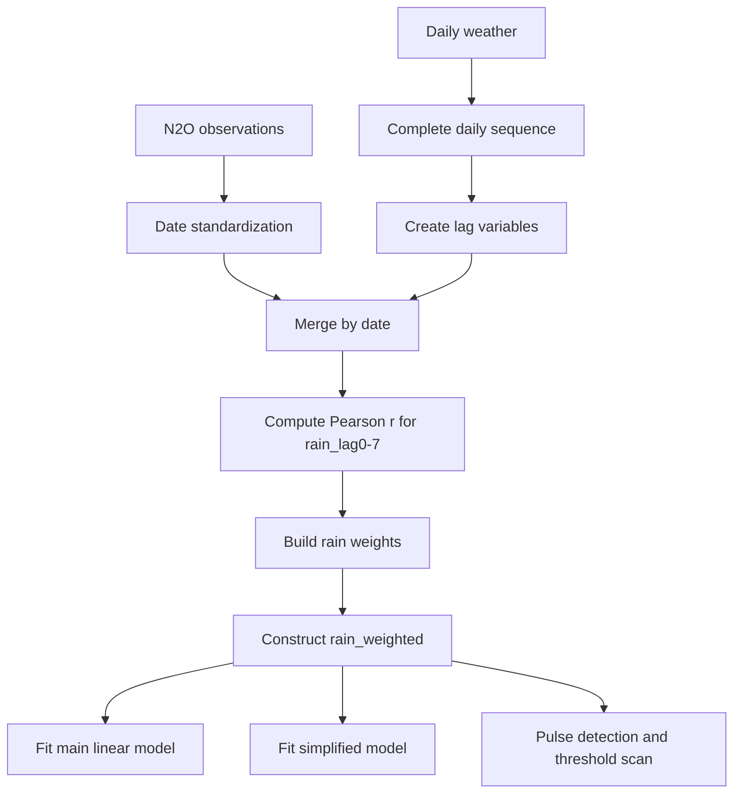

# 建立與撰寫可發表之 N2O 排放預測模型

## 摘要與交付內容

本文件整合模型建立、可重現程式碼、論文可用章節文字、診斷與詮釋四個面向，目標是在不改變既有核心設計下，將整體流程整理成可直接放入論文的 **Materials and Methods** 與 **Statistical Analysis**，並搭配一份可重跑的 `R` 腳本用於輸出表格與圖形。

本研究資料包含兩部分：

- 五種施肥處理 A–E 之 N2O 通量觀測值，共 505 筆，其中有效建模樣本 495 筆。
- 全年逐日氣象資料，共 365 天。

模型核心特徵工程包括：

- 建立 `rain_lag0` 到 `rain_lag7`
- 以 N2O 與各 `rain_lag` 的 Pearson 相關係數絕對值建立權重
- 整合成多日降雨脈衝指標 `rain_weighted`

主要模型為：

```r
N2O_flux ~ rain_weighted * fertilizer_N + soil_temp_lag1 + temp_lag1 + humidity_lag1
```

此外，本文件也保留三個延伸方向：

- 不納入土壤變數的簡化模型
- pulse detection 與 rainfall trigger threshold
- 可選進階模型（GAM、Random Forest、XGBoost）

## 資料輸入與前處理流程

資料前處理以完整逐日時間序列為基礎，以確保 lag 變數真正代表前一天或前幾天條件，而不是前一筆觀測。

前處理步驟如下：

1. 將所有日期欄位標準化為 `Date`
2. 將氣象與 N2O_flux 欄位轉為 numeric
3. 建立完整逐日序列
4. 建立 lag 變數：
   - `rain_lag0` 到 `rain_lag7`
   - `temp_lag1`
   - `humidity_lag1`
   - `soil_temp_lag1`
5. 依日期合併 N2O 觀測與 lag 後氣象資料
6. 以 Pearson 相關係數建立 `rain_weighted`

整體流程可概括為：



## 變數定義

| 變數名稱 | 類型 | 說明 |
|---|---|---|
| `date` | 鍵 | 日期 |
| `treatment` | 分組 | A–E 五處理 |
| `fertilizer_N` | 解釋變數 | 施氮量 0、100、200、400、600 |
| `N2O_flux` | 應變數 | N2O 通量 |
| `rain` | 原始氣象 | 當日降雨量 |
| `rain_lag0` 到 `rain_lag7` | 特徵工程 | 當日至前 7 日降雨量 |
| `rain_weighted` | 特徵工程 | 多日降雨脈衝指標 |
| `temp_lag1` | 解釋變數 | 前一日氣溫 |
| `humidity_lag1` | 解釋變數 | 前一日相對溼度 |
| `soil_temp_lag1` | 解釋變數 | 前一日土壤溫度 |

## 加權雨量指標

加權雨量指標定義如下：

\[
\text{rain\_weighted}=\sum_{i=0}^{7}\left(rain\_lag_i\times\frac{|r_i|}{\sum_{j=0}^{7}|r_j|}\right)
\]

其中 `r_i` 為 `rain_lag_i` 與 `N2O_flux` 的 Pearson 相關係數。

若目前已有結果顯示：

- `rain_lag1` 相關最高
- `rain_lag4` 次高
- `rain_lag0` 第三

則可解讀為：N2O 排放不只是對單日降雨反應，而是受到即時與短中期累積降雨脈衝共同驅動。

## Materials and Methods

本研究以五種施肥處理（A–E；施氮量分別為 0、100、200、400、600 kg N ha^-1）之 N2O 通量觀測資料為基礎（共 505 筆，其中有效分析樣本數為 495 筆），結合全年逐日氣象資料（365 天），建立 N2O 排放預測模型。

資料前處理首先將所有資料日期欄位標準化為 `Date` 類型，並以全年逐日氣象序列建立完整時間軸，以確保延遲變數之計算不受缺日影響。其後，為反映降雨對土壤水分狀態及微生物反應可能存在之延遲效應，計算當日至前 7 日逐日降雨量（`rain_lag0` 至 `rain_lag7`），並以各延遲雨量與 N2O 通量之 Pearson 相關係數絕對值作為權重，建立加權雨量指標 `rain_weighted`。

模型建立採多元線性迴歸，以 N2O 通量（`N2O_flux`）為應變數，將加權雨量（`rain_weighted`）、施肥量（`fertilizer_N`）、前一日土壤溫度（`soil_temp_lag1`）、前一日氣溫（`temp_lag1`）、前一日相對溼度（`humidity_lag1`），以及加權雨量與施肥量之交互作用項納入解釋變數。模型建立完成後，進一步套用於全年逐日氣象資料，以模擬不同施肥情境下之每日 N2O 排放動態，作為年度排放風險與精準施肥評估之依據。

## Statistical Analysis

本研究以多元線性迴歸建立 N2O 排放量預測模型。模型整體顯著，顯示本模型所納入之因子可解釋部分 N2O 排放變異。

模型重點解讀如下：

- `fertilizer_N` 顯著正向，代表施氮量增加會提高 N2O 基礎排放水準。
- `rain_weighted` 單獨主效應可能不顯著，表示降雨不是獨立驅動因子。
- `rain_weighted × fertilizer_N` 若高度顯著，代表降雨脈衝在高氮條件下會顯著放大 N2O 排放反應。
- `soil_temp_lag1`、`temp_lag1`、`humidity_lag1` 則反映微生物與環境條件對排放之背景調節。

交互作用的科學意義可表達為：

\[
\frac{\partial N2O}{\partial rain\_weighted}=\beta_1+\beta_6 \cdot fertilizer\_N
\]

\[
\frac{\partial N2O}{\partial fertilizer\_N}=\beta_2+\beta_6 \cdot rain\_weighted
\]

這表示：

- 在低施肥條件下，降雨對 N2O 的影響有限。
- 在高施肥條件下，降雨會放大 N2O 脈衝。

換言之，降雨是 trigger，氮是 amplifier。

## 脈衝（pulse）定義與門檻

在土壤 N2O 排放研究中，pulse 指短時間內排放量突然升高、隨後回落的尖峰事件。實務上可將 `N2O_flux` 高於某一統計門檻者定義為 pulse，例如：

- 第 75 百分位以上
- 平均值加一個標準差以上

將 `pulse` 定義為二元變數後，可進一步使用 logistic regression 建立 pulse detection model，並對 `rain_weighted` 進行 threshold scan，以 Youden 指數找出較佳降雨觸發門檻。

## 模型限制

本模型的限制包括：

- 尚未納入土壤無機氮（NH4+、NO3-）
- 採樣頻率可能不足以完整捕捉瞬時尖峰
- 線性模型難以完全描述非線性 pulse
- `rain_weighted` 屬 supervised 特徵工程，若做交叉驗證，應在每個 training fold 中重估權重

## 管理意涵

結果最具管理價值之處在於：

- 降雨本身不是唯一原因
- 高施氮下遇到降雨脈衝才是高風險情境

因此，實務上可依據前期降雨或即將到來之降雨條件調整施肥時機，藉以降低 N2O 排放風險。

## 檔案對應

本報告對應的可重現程式碼見：

- `N2O_model_pipeline.R`

建議輸出內容包括：

- 係數表
- 模型比較表
- rain lag 權重表
- Observed vs Predicted
- Residual plot
- monthly heatmap
- pulse probability curve
- Youden threshold scan
