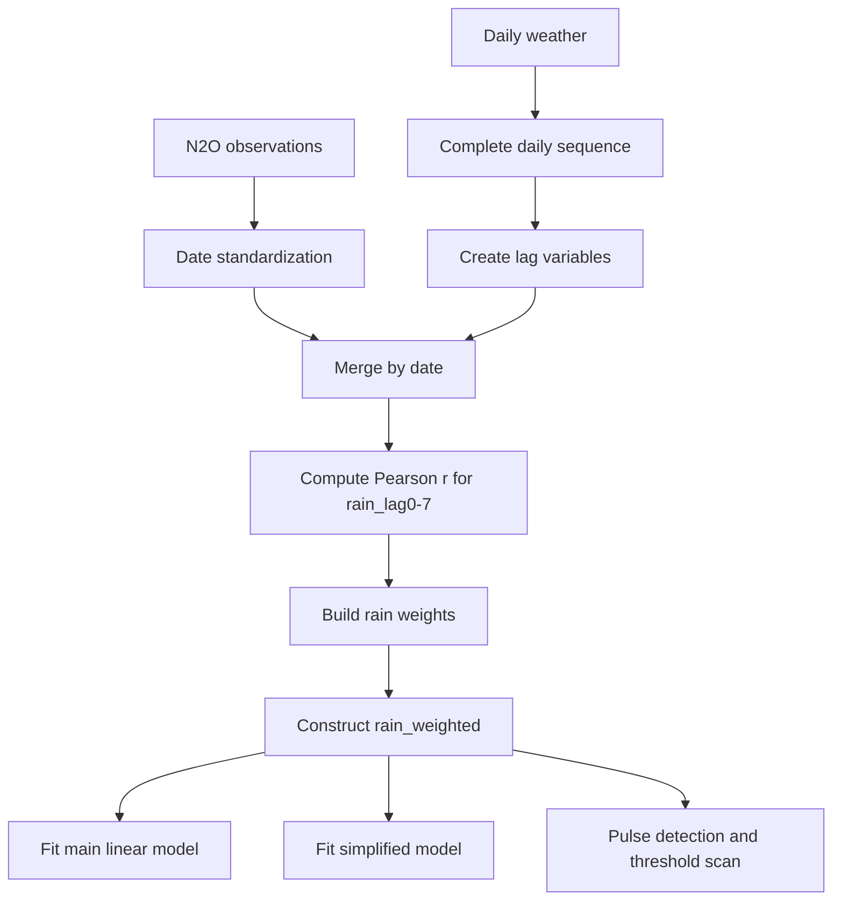

# 建立與撰寫可發表之 N2O 排放預測模型

## 摘要與交付內容

本整理稿把你目前已完成的核心設計，系統化整合成四個可直接使用的成果：

- 論文可用的 Materials & Methods 文字
- 論文可用的 Statistical Analysis 文字
- 一份可重現的 R 分析腳本
- 模型診斷、脈衝偵測與管理意涵的統整說明

本研究資料包含兩部分：

- 五種施肥處理 A-E 的 N2O 通量觀測資料，共 505 筆，其中有效建模樣本為 495 筆
- 全年逐日氣象資料，共 365 天

核心特徵工程為先建立 rain_lag0-rain_lag7，再以各 lag 與 N2O_flux 的 Pearson 相關係數絕對值作為權重，形成加權雨量指標 rain_weighted。主模型形式如下：

```r
N2O_flux ~ rain_weighted * fertilizer_N + soil_temp_lag1 + temp_lag1 + humidity_lag1
```

另提供三個延伸方向：

- 不納入土壤變數的簡化模型
- pulse detection 與 rainfall trigger threshold 流程
- 與進階模型比較時可沿用的評估架構

## 資料輸入與前處理流程

本研究以前處理後的完整逐日序列作為 lag 計算基礎，以確保 lag1、lag2 等確實對應前 1 天、前 2 天，而不是前一筆觀測值。

建議處理步驟如下：

1. 將所有資料日期欄轉為 `Date`
2. 將 N2O_flux、rain、temp、humidity、soil_temp、fertilizer_N 等欄位轉為 numeric
3. 依日期建立完整逐日序列
4. 建立 lag 變數
   - `rain_lag0` 到 `rain_lag7`
   - `temp_lag1`
   - `humidity_lag1`
   - `soil_temp_lag1`
5. 以日期合併 N2O 觀測資料與 lag 氣象資料
6. 以 Pearson 相關建立 rain weight，進一步形成 `rain_weighted`

整體流程可表達為：



## 變數定義

| 變數名稱 | 類型 | 說明 |
|---|---|---|
| `date` | 鍵 | 日期 |
| `treatment` | 分組 | A-E 五種處理 |
| `fertilizer_N` | 解釋變數 | 施氮量 0、100、200、400、600 |
| `N2O_flux` | 應變數 | N2O 通量 |
| `rain` | 原始氣象 | 當日降雨量 |
| `rain_lag0` 到 `rain_lag7` | 特徵工程 | 當日至前 7 日降雨 |
| `rain_weighted` | 特徵工程 | 多日降雨脈衝指標 |
| `temp_lag1` | 解釋變數 | 前一日平均氣溫 |
| `humidity_lag1` | 解釋變數 | 前一日相對溼度 |
| `soil_temp_lag1` | 解釋變數 | 前一日土壤溫度 |

## 加權雨量指標

加權雨量指標定義為：

\[
\text{rain\_weighted}=\sum_{i=0}^{7}\left(rain\_lag_i\times\frac{|r_i|}{\sum_{j=0}^{7}|r_j|}\right)
\]

其中 `r_i` 為 `rain_lag_i` 與 `N2O_flux` 的 Pearson 相關係數。

依你目前結果，權重結構的重點為：

- `rain_lag1` 相關最高
- `rain_lag4` 次高
- `rain_lag0` 亦具一定貢獻

這表示 N2O 排放並非只受單日降雨影響，而較符合多日降雨累積與短中期延遲反應共同作用的機制。

## Materials and Methods

本研究以五種施肥處理 A-E 之 N2O 通量觀測資料作為建模基礎，施氮量分別為 0、100、200、400、600 kg N ha^-1。原始觀測資料共 505 筆，經缺值排除後之有效分析樣本為 495 筆，並結合全年逐日氣象資料 365 天建立 N2O 排放預測模型。

資料前處理首先將所有日期欄位標準化為 `Date` 型態，並以完整逐日氣象序列建立時間軸，以確保延遲變數計算之準確性。接續計算當日至前 7 日降雨量 `rain_lag0` 至 `rain_lag7`，並根據各延遲降雨與 N2O 通量之 Pearson 相關係數絕對值建立加權雨量指標 `rain_weighted`，以整合即時與延遲降雨效應。

本研究以 N2O 通量 `N2O_flux` 為應變數，將 `rain_weighted`、`fertilizer_N`、`soil_temp_lag1`、`temp_lag1`、`humidity_lag1` 以及 `rain_weighted × fertilizer_N` 納入多元線性迴歸模型，模型式如下：

\[
N2O\_flux =
\beta_0 +
\beta_1 \cdot rain\_weighted +
\beta_2 \cdot fertilizer\_N +
\beta_3 \cdot soil\_temp\_lag1 +
\beta_4 \cdot temp\_lag1 +
\beta_5 \cdot humidity\_lag1 +
\beta_6 \cdot (rain\_weighted \times fertilizer\_N)
\]

所有分析以 R 執行，顯著性水準設定為 alpha = 0.05。模型建立完成後，再將模型套用至全年逐日氣象資料與不同施肥情境，以模擬年度每日 N2O 排放動態。

## Statistical Analysis

以多元線性迴歸建立 N2O 排放量預測模型，模型整體達顯著水準，顯示納入之環境與管理因子可顯著解釋部分 N2O 排放變異。依你目前結果，模型的核心統計特徵可整理如下：

- `fertilizer_N` 為顯著正向因子
- `rain_weighted` 單獨主效應不顯著
- `rain_weighted × fertilizer_N` 交互作用高度顯著
- `soil_temp_lag1` 呈顯著效應
- `temp_lag1` 接近顯著

此結果表示降雨本身並非 N2O 排放的獨立驅動因子，而是在高施氮條件下，降雨脈衝會顯著放大排放反應。也就是說，降雨較接近 trigger，而氮供應則扮演 amplifier 的角色。

## 脈衝定義與 pulse detection

在本研究中，N2O 排放的 pulse 可定義為短時間內顯著高於背景值的尖峰事件。為了讓 pulse 判定具可重現性，可將連續的 `N2O_flux` 轉換為二元事件，例如：

- 高於第 75 百分位定義為 pulse
- 或採用平均值加 1 個標準差作為門檻

完成 pulse 定義後，可用 logistic regression 建立 pulse detection model，並以 `rain_weighted` 執行 threshold scan，找出最適合的 rainfall trigger threshold。

## 研究限制

本模型仍有幾項重要限制：

- 未納入土壤無機氮如 NH4+、NO3-
- 觀測頻率可能無法完全捕捉短暫 pulse
- 線性模型對強烈非線性脈衝的描述能力有限
- `rain_weighted` 屬於 supervised 特徵工程，若後續進行交叉驗證，理想上應在每個 training fold 內重估權重

## 管理意涵

本研究最具操作性的訊息是：在高施肥條件下，降雨事件後的 N2O 排放風險明顯提高。因此可進一步發展兩個應用方向：

- 以降雨脈衝與施肥量共同評估高風險期
- 將模型套用到逐日氣象或氣象預報資料，作為施肥時機調整依據

## 檔案對應

本整理稿對應的可重現程式為：

- `N2O_model_pipeline.R`

執行後可輸出：

- 相關係數與 rain lag 權重表
- 主模型與簡化模型係數表
- rain lag 權重結果
- Observed vs Predicted
- Residual plot
- monthly heatmap
- pulse probability curve
- Youden threshold scan
